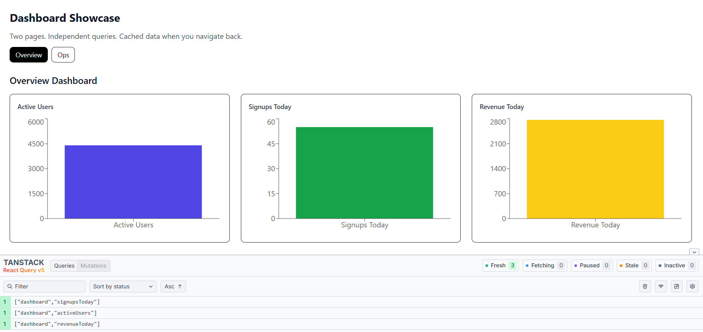
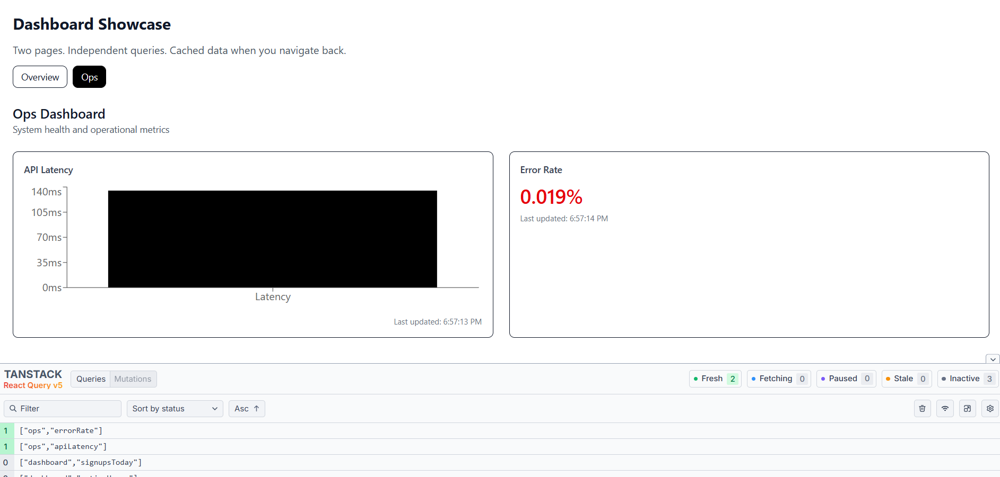
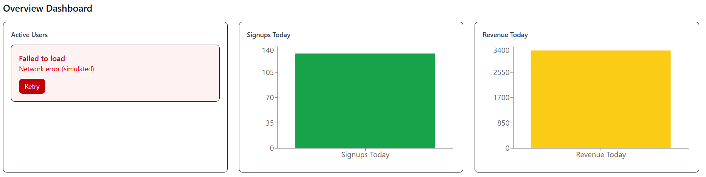
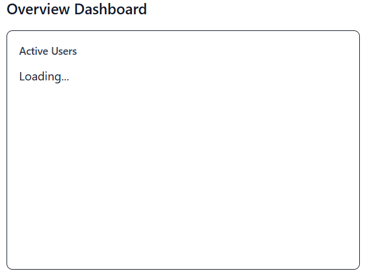
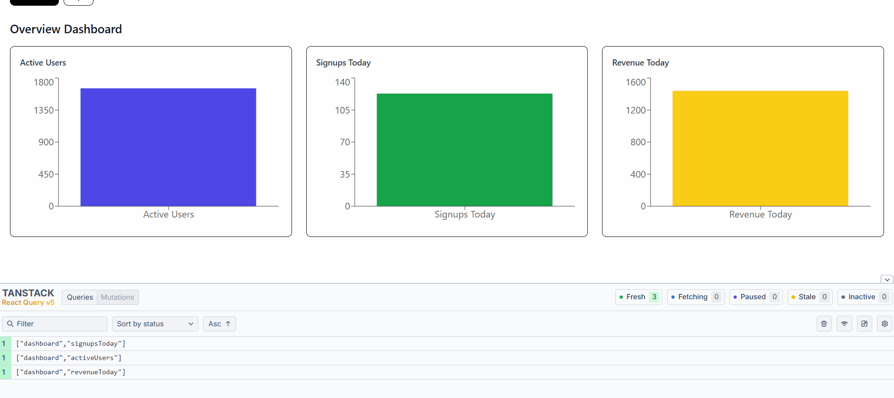

📊 Dashboard Showcase
---------------------------
A modern dashboard showcase application built with React + TypeScript, demonstrating best practices for data fetching, caching, state isolation, error handling, and chart visualization.

This project is intentionally designed to reflect real-world frontend architecture, similar to dashboards found in products like Google Analytics, Cloudflare, Datadog, or internal admin tools.


✨ Purpose of This Project
---------------------------
Many frontend roles require experience with dashboards, data-heavy UIs, and performance-aware state management.

This project showcases:

- Independent dashboard widgets (charts)
- Isolated data fetching per chart
- Smart caching and refetch strategies
- Clear separation of concerns
- Production-ready project structure

It is not a UI-only demo, but a data-driven frontend system.

🧰 Tech Stack
--------------
- React (with Hooks)
- TypeScript (strict mode)
- TanStack Query (React Query)
  - Data fetching
  - Caching
  - Background refetching
  - Error & loading states
- Recharts
  - Data visualization
- Tailwind CSS (v4)
  - Utility-first styling
- Vite
  - Fast dev server and build tool

🗂️ Project Structure
---------------------
```txt
src/
 ├─ api/
 │    ├─ overviewApi.ts
 │    ├─ opsApi.ts
 │    └─ helpers.ts
 │
 ├─ components/
 │    ├─ charts/
 │    │    ├─ overview/
 │    │    │    ├─ ActiveUsersChart.tsx
 │    │    │    ├─ SignupsTodayChart.tsx
 │    │    │    └─ RevenueTodayChart.tsx
 │    │    └─ ops/
 │    │         ├─ ApiLatencyChart.tsx
 │    │         └─ ErrorRateChart.tsx
 │    │
 │    └─ shared/
 │         ├─ DashboardCard.tsx
 │         └─ ErrorFallback.tsx
 │
 ├─ pages/
 │    ├─ OverviewPage.tsx
 │    └─ OpsPage.tsx
 │
 ├─ App.tsx
 └─ main.tsx
```
Why this structure?

- Charts are grouped by domain (overview vs ops)
- Each chart is independent
- Shared UI logic lives in shared/
- APIs are separated by responsibility

This mirrors how dashboards are structured in large-scale applications.

🔌 API Design (Fake APIs)
--------------------------
This project uses simulated APIs to mimic real backend behavior:

- Network latency
- Random failures
- Independent endpoints

Example: overviewApi.ts:
```txt
export function fetchActiveUsers(): Promise<ActiveUsersResponse> {
  return simulateRequest(() => ({
    activeUsers: Math.floor(1000 + Math.random() * 9000),
    timestamp: new Date().toISOString(),
  }));
}
```
Why separate APIs?

✅ Realistic architecture
In production, different metrics often come from different services.

✅ Failure isolation
If one API fails, only that chart fails — not the entire dashboard.

✅ Independent caching & refetching
Each chart controls its own freshness.

📈 Dashboard Architecture
--------------------------
Each chart:
- Has its own API
- Has its own React Query
- Has its own loading, error, and refresh logic

Example:
```txt
const { data, isLoading, isError, refetch } = useQuery({
  queryKey: ["dashboard", "activeUsers"],
  queryFn: fetchActiveUsers,
  staleTime: 5 * 60 * 1000,
});
```
Benefits:
- Charts can refresh independently
- One failed request doesn’t break the page
- Cached data is reused when navigating between pages

🔁 Caching & Performance Strategy
----------------------------------
Using TanStack Query:
- staleTime controls data freshness
- refetchInterval is used for live operational metrics
- refetchOnWindowFocus disabled to avoid unnecessary requests
- Queries are cached across route changes

Example behavior:
- Navigate from Overview → Ops → Overview
- Data is not refetched if still fresh
- UI feels instant

⚠️ Error Handling Strategy
--------------------------
Each chart handles its own error state:

```txt
if (isError) {
  return (
    <ErrorFallback
      message={(error as Error).message}
      onRetry={() => refetch()}
    />
  );
}
```
Why this matters:
- Partial failures are expected in real systems
- Users can retry a single widget
- Dashboard remains usable

🎨 UI & Layout
--------------------------
- Responsive grid layout
- Each chart lives inside a DashboardCard
- Charts adapt to container size using ResponsiveContainer

This allows:
- Multiple charts per row
- Easy future expansion
- Consistent UI across dashboards

🧪 Dev Experience
------------------
- Path aliases (@/) for clean imports
- Strict TypeScript rules
- React Query Devtools for debugging cache & fetch behavior

Example import:
import { fetchApiLatency } from "@/api/opsApi";

🧠 What This Project Demonstrates
----------------------------------
- Strong understanding of frontend system design
- Real-world dashboard patterns
- Production-ready React architecture
- Thoughtful state and data management

## 📸 Screenshots
--------------------

### Overview Dashboard


### Ops Dashboard


### Overview Error State 


### Chart Loading State


## Dashboard Demo



👤 Author
----------
**Joe Sleiman**<br />
Frontend Engineer<br />
React · TypeScript · Dashboards · Performance
